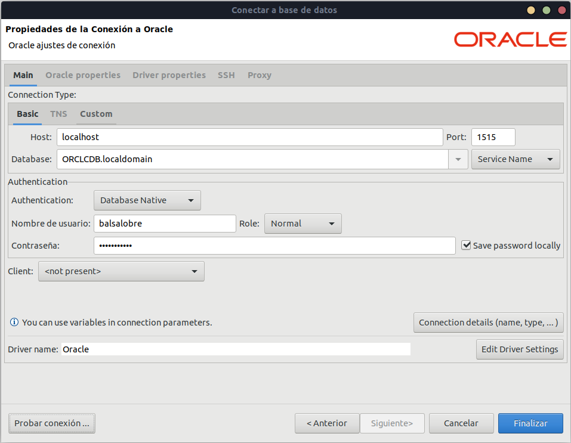

# Montaje de entorno Oracle

Nos vamos a la pagina de docker y nos vamos a la imagen **Oracle Database Enterprise Edition** y a la de **Oracle WebLogic Server** (Aceptamos todos los terminos y condiciones - Proced ckeckout)

```docker pull store/oracle/database-enterprise:12.2.0.1```

```docker pull store/oracle/weblogic:12.2.1.4-dev-200117```

## Configuración y despliegue de una OracleDB

Vamos a necesitar la herramienta nettools para conocer si el puerto está o no disponible.

```sudo apt install net-tools```

Necesitaremos el puerto 1521 y el 8080 para un pequeño cliente que nos da oracleDB

a los que están escuchando | p pid de la app | v verbose | n info (host puerto) | o info timer de la red
``` netstat -vapno
    netstat -vapno | grep 1521
```
A continuación levantamos el contenedor de oracle si tenemos disponible el puerto. Usamos el puerto 1515 de nuestra máquina. Por el momento en el STATUS lo vamos a ver --> Up 2 minutes (healthy) cuando se termine de configurar deberá de ponerse en (started).

```docker run -d -p 8080:8080 -p 1515:1521 --name real-oracle-db store/oracle/database-enterprise:12.2.0.1```

Podemos ver que tenemos el contenedor levantado con:

```
    docker logs real-oracle-db
    docker exec -ti real-oracle-db bash
```

Probar el cliente sql plus desde el contenedor.

```docker exec -ti real-oracle-db bash -c "source /home/oracle/.bashrc; sqlplus /nolog"```

Usuario y contraseña:

```connect sys as sysdba    |||||   Oradoc_db1```

## Creación de usuario y privilegios

Modificamos la sesión para porder lanzar scripts.

```alter session set "_oracle_script"=true;```

Creación de usuario y contraseña:

```create user balsalobre identified by supersegura```

Permisos para trabajar con este usuario.

```GRANT CONNECT, RESOURCE, DBA TO balsalobre;```

Probamos el acceso con un cliente de base de datos [script](./insert_data.sql)




