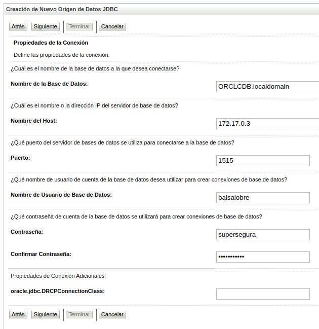

# Montaje de entorno Oracle

Nos vamos a la pagina de docker y nos vamos a la imagen **Oracle Database Enterprise Edition** y a la de **Oracle WebLogic Server** (Aceptamos todos los terminos y condiciones - Proced ckeckout)

```docker pull store/oracle/database-enterprise:12.2.0.1```

```docker pull store/oracle/weblogic:12.2.1.4-dev-200117```

## Configuración y despliegue de una OracleDB

Vamos a necesitar la herramienta nettools para conocer si el puerto está o no disponible.

```sudo apt install net-tools```

Necesitaremos el puerto 1521 y el 8080 para un pequeño cliente que nos da oracleDB

a los que están escuchando | p pid de la app | v verbose | n info (host puerto) | o info timer de la red
``` netstat -vapno
    netstat -vapno | grep 1521
```
A continuación levantamos el contenedor de oracle si tenemos disponible el puerto. Usamos el puerto 1515 de nuestra máquina. Por el momento en el STATUS lo vamos a ver --> Up 2 minutes (healthy) cuando se termine de configurar deberá de ponerse en (started).

```docker run -d -p 8080:8080 -p 1515:1521 --name real-oracle-db store/oracle/database-enterprise:12.2.0.1```

Podemos ver que tenemos el contenedor levantado con:

```
    docker logs real-oracle-db
    docker exec -ti real-oracle-db bash
```

Probar el cliente sql plus desde el contenedor.

```docker exec -ti real-oracle-db bash -c "source /home/oracle/.bashrc; sqlplus /nolog"```

Usuario y contraseña:

```connect sys as sysdba    |||||   Oradoc_db1```

## Creación de usuario y privilegios

Modificamos la sesión para porder lanzar scripts.

```alter session set "_oracle_script"=true;```

Creación de usuario y contraseña:

```create user balsalobre identified by supersegura```

Permisos para trabajar con este usuario.

```GRANT CONNECT, RESOURCE, DBA TO balsalobre;```

Probamos el acceso con un cliente de base de datos [script](./insert_data.sql)


## Desplegar el contenedor de WebLogic

Nos definimos con export una serie de variables para tenerlas de forma general.

```
    export MY_HOME=$HOME/Projects/courses/docker-curso/26_Containers_Oracle/
    cd $MY_HOME
```

Introducimos en un fichero las propiedades:

```
cat <<EOF > domain.properties   |   (Escribir en el fichero hasta que ecuentres EOF)
username=weblogic
password=1234webl
EOF
```

Creación de variable de entorno para las propiedades:

```
    export PWD_WL=/$MY_HOME/domain.properties
```

El contenedor de weblogic va a necesitar de 2 puertos:
    - El puerto 7001 para podernos conectar al contenedor.  | netstat -anop | grep 7001
    - El puerto 9002 nos permite conectarnos al portal.     | netstat -anop | grep 7001

Contenedor

(NO FUNCIONA)
```
docker run -d --name oracle-wl -p 7001:7001 -p 9002:9002 -v $PWD_WL:/u01/oracle/properties/domain.properties store/oracle/weblogic:12.2.1.4-dev-200117
```
(SI FUNCIONA)
```
docker run -d --name mi_oracle_wl --env DOMAIN_NAME=base_domain -it -p 7001:7001 -p 9002:9002 -v $PWD_WL:/u01/oracle/properties/domain.properties store/oracle/weblogic:12.2.1.4-dev-200117 /bin/bash -c "./createAndStartEmptyDomain.sh"
```
Consultar log y acceder login/pass aceptando el certificado en:

    - https://localhost:9002/console/
    - https://localhost:9002/console/login/LoginForm.jsp

## Conexión desde weblogic a oracledb

Debemos conocer la ip que tenemos asignada al contenedor donde está oracledb. Usaremos para esto docker inspect.

```
docker inspect real-oracle-db
docker inspect --format='{{range .NetworkSettings.Networks}}{{.IPAddress}}{{end}}' real-oracle-db
docker inspect -f '{{range .NetworkSettings.Networks}}{{.IPAddress}}{{end}}' real-oracle-db
```
En weblogic para poder hacer cambios debemos pulsar en **Bloquear y Editar** (Arriba izquierda)

Nos vamos a web logic ahora a la sección de servicios y acceder a origenes de datos. Creamos uno nuevo de origen genérico.

    - Nombre: JDBC Oracle DB OpenWebinar
    - Nombre de JNDI: jdbc/sysdba
    - Tipo de base de datos: Oracle
    - Siguiente

    - Controlador de Base de Datos: *Oracle’s Driver (Thin XA) for Application Continuity; Versions:Any
    - Siguiente
    - Siguiente




    - Siguiente
    - Nombre de clase del controlador: oracle.jdbc.xa.client.OracleXADataSource
    - Siguiente

Podemos crear un dominio para esta conexión que acabamos de crear. Lo vamos a poner al dominio que nos crea por defecto. El del AdminServer y pulsamos en termninar.

Podemos ir a comprobar el estado de la conexión pulsando en la propia conexión que se ha creado. En la pestaña Supervisión > Prueba y pulsamos sobre AdminServer y Probar Origen de Datos.

```
    Correcto La prueba JDBC Oracle DB en el servidor AdminServer se ha realizado correctamente.
```

## Consumo de OracleDB a través de  un API Rest

CAPAS:
    - BBDD (springBoot).
    - Capa de transferencia DTO (BBDD --> Repositorio).
    - Repositorio (Interfaz con los métodos que vamos a tener).
    - Servicio.
    - Recurso (endPoint).